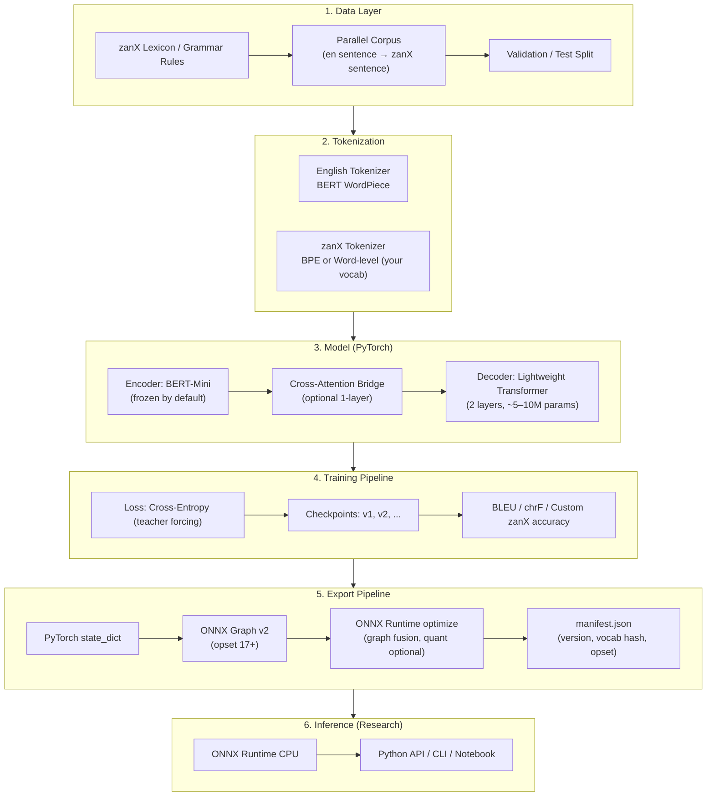
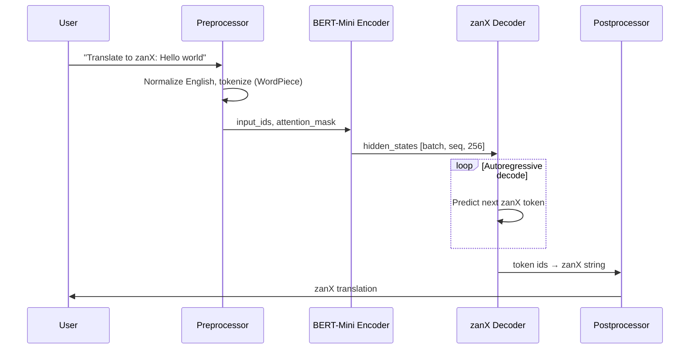
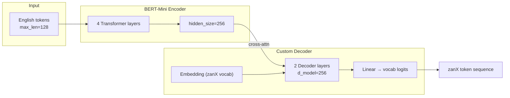
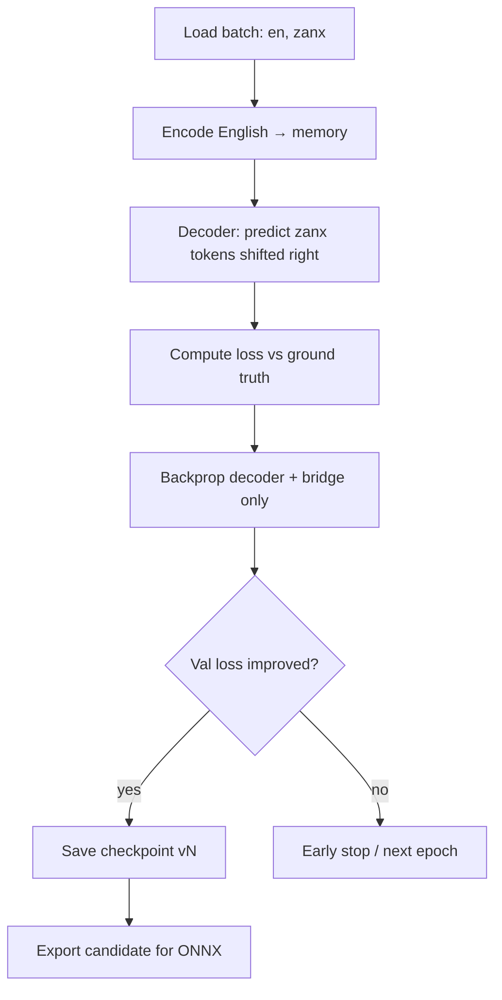
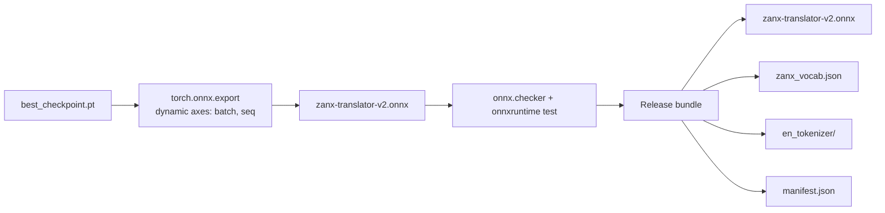
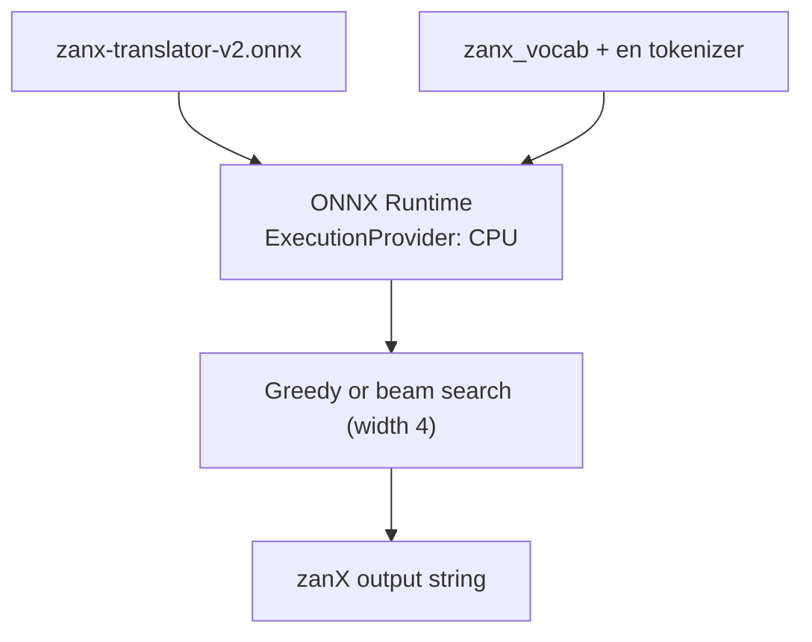

# zanX Translator — System Architecture

English → **zanX** research translator using a lightweight encoder (**BERT-Mini** by default) and a custom decoder trained only on your corpus. Exported as **ONNX v2** for CPU inference on Windows (≤ 8 GB RAM).

---

## 1. Design Principles

| Principle | Decision |
|-----------|----------|
| English understanding | Reuse **BERT-Mini encoder** (`prajjwal1/bert-mini`, ~11M params) — pretrained on English only |
| zanX specificity | Train **decoder + zanX tokenizer** on *your* parallel data only |
| No internet-scale NMT | Do **not** use OPUS/Marian/T5 full checkpoints for zanX |
| Offline dev | Download encoder once to `artifacts/models/`; train and infer with no internet |
| RAM budget | Target **&lt; 300 MB** ONNX inference, **&lt; 3 GB** peak training RAM |
| Research export | Versioned artifacts: `zanx-translator-v2.onnx` + vocab + manifest |

**Important:** BERT-Mini is an **encoder**, not a translator. Architecture is **encoder–decoder**: the frozen encoder reads English; a small custom decoder generates zanX.

---

## 2. High-Level Architecture



---

## 3. End-to-End Data Flow



---

## 4. Component Detail

### 4.1 Data Layer

```
data/
├── raw/
│   ├── en_zanx_pairs.tsv      # source \t target
│   └── zanx_lexicon.json      # word, gloss, POS, morphology
├── processed/
│   ├── train.jsonl
│   ├── val.jsonl
│   └── test.jsonl
└── tokenizer/
    ├── en/                    # prajjwal1/bert-mini (local copy)
    └── zanx/                  # custom BPE / SentencePiece model
```

**Minimum viable corpus (research):**
- 500–2,000 sentence pairs for prototype
- 5,000–20,000 pairs for usable quality
- Hold out 10% for validation

### 4.2 Model Stack



**Parameter budget (approx.):**

| Component | Params | Trainable |
|-----------|--------|-----------|
| BERT-Mini encoder | 11M | Frozen (default) or last 1 layer |
| Cross-attention bridge | 1–2M | Yes |
| Lightweight decoder | 5–10M | Yes |
| **Total inference** | **~17–23M** | — |

### 4.2.1 Encoder alternatives (all offline-capable)

| Model | Params | Disk | Use when |
|-------|--------|------|----------|
| `prajjwal1/bert-tiny` | 4.4M | ~17 MB | Pipeline smoke tests only |
| **`prajjwal1/bert-mini`** | **11M** | **~45 MB** | **Default — best balance** |
| `huawei-noah/TinyBERT_4L_312D` | 14.5M | ~55 MB | Need stronger English, still tiny |
| `sentence-transformers/paraphrase-MiniLM-L3-v2` | 17M | ~70 MB | Pre-built ONNX for experiments |
| `distilbert-base-uncased` | 66M | ~260 MB | Maximum English quality if RAM allows |

### 4.3 Training Loop



**Recommended hyperparameters (8 GB RAM, CPU):**

| Setting | Value |
|---------|-------|
| batch_size | 4–8 (gradient accumulation 4) |
| max_en_len | 128 |
| max_zanx_len | 128 |
| learning_rate | 3e-5 (decoder), 1e-5 (encoder if unfrozen) |
| epochs | 20–50 with early stopping |
| optimizer | AdamW, weight_decay 0.01 |

### 4.4 Export Pipeline (v2 ONNX)



**manifest.json example:**

```json
{
  "model_version": "v2",
  "format": "onnx",
  "opset": 17,
  "encoder": "prajjwal1/bert-mini",
  "decoder_layers": 2,
  "max_seq_len": 128,
  "created": "2026-06-30",
  "corpus_hash": "sha256:..."
}
```

### 4.5 Inference Runtime



**Expected RAM at inference:** ~200–350 MB (FP32), ~100–200 MB (INT8 dynamic quant, optional).

---

## 5. Repository Layout (Proposed)

```
lang-translator/
├── docs/
│   ├── ARCHITECTURE.md          # this file
│   ├── PREREQUISITES.md
│   └── TRAINING_GUIDE.md
├── data/                        # gitignored except samples
├── src/
│   ├── data/
│   │   ├── prepare_corpus.py
│   │   └── build_zanx_tokenizer.py
│   ├── model/
│   │   ├── encoder.py           # BERT-Mini wrapper
│   │   ├── decoder.py           # lightweight transformer decoder
│   │   └── translator.py        # full seq2seq module
│   ├── train/
│   │   └── train.py
│   ├── export/
│   │   └── export_onnx.py
│   └── infer/
│       └── onnx_runtime_infer.py
├── configs/
│   └── default.yaml
├── artifacts/                   # gitignored
│   ├── models/                  # offline encoder weights (bert-mini)
│   ├── checkpoints/
│   └── releases/
│       └── v2/
├── requirements.txt
└── README.md
```

---

## 6. Versioning Strategy

| Version | Meaning |
|---------|---------|
| v0 | Tokenizer + data pipeline only |
| v1 | First trained PyTorch checkpoint |
| **v2** | ONNX export validated on CPU — **research release** |
| v3+ | New corpus or architecture changes |

Always bump `model_version` in manifest when re-exporting ONNX.

---

## 7. Alternatives Considered

| Approach | Why not primary |
|----------|-----------------|
| Full MarianMT / mBART | Pretrained on massive web corpora — opposite of your goal |
| Fine-tune T5-small end-to-end | Heavier; seq2seq pretrained on C4 |
| Train from scratch | Needs huge data; BERT-Mini gives English for free |
| LLM (Phi, Llama) | Won't fit 8 GB RAM training; overkill for constrained zanX |

---

## 8. Risk & Mitigation

| Risk | Mitigation |
|------|------------|
| Small zanX corpus → poor generalization | Data augmentation; lexicon constraints at decode |
| ONNX export fails (dynamic decode loop) | Export encoder + single decoder step; run loop in Python OR export greedy unroll for fixed max_len |
| OOM on 8 GB | Freeze encoder; small batch + grad accumulation; `max_len=64` |
| Encoder adds unwanted general knowledge | Freeze encoder; only decoder learns zanX mapping |

---

## 9. Next Steps

1. Define zanX alphabet, lexicon, and first 500 sentence pairs
2. Download encoder offline: `huggingface-cli download prajjwal1/bert-mini --local-dir artifacts/models/bert-mini`
3. Scaffold `src/` per layout above
4. Train v1 PyTorch model on CPU
5. Validate translations on held-out set
6. Export and benchmark **v2 ONNX** with ONNX Runtime
7. Document reproducibility (corpus hash, seeds, config) for research paper
