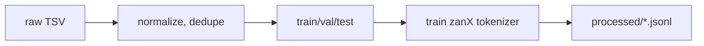

# Training Guide — English → zanX

Step-by-step workflow from empty repo to **ONNX v2** research artifact.

---

## Phase 0: Define zanX

1. Document phonology, orthography, and grammar at a level sufficient for consistent translation.
2. Build `data/raw/zanx_lexicon.json`:
   ```json
   {
     "words": [
       {"zanx": "...", "en": "hello", "pos": "interjection"}
     ]
   }
   ```
3. Collect parallel sentences into `data/raw/en_zanx_pairs.tsv`.

---

## Phase 1: Data Pipeline



**Each JSONL record:**
```json
{"en": "The cat sleeps.", "zanx": "<zanX sentence>"}
```

**Commands (to implement in `src/data/`):**
```powershell
python src/data/prepare_corpus.py --input data/raw/en_zanx_pairs.tsv --out data/processed/
python src/data/build_zanx_tokenizer.py --input data/raw/zanx_monolingual.txt --out artifacts/tokenizer/zanx/
```

---

## Phase 1.5: Download encoder (one-time, offline after this)

```powershell
pip install huggingface_hub
huggingface-cli download prajjwal1/bert-mini --local-dir artifacts/models/bert-mini

$env:TRANSFORMERS_OFFLINE = "1"
$env:HF_HUB_OFFLINE = "1"
```

---

## Phase 2: Model Initialization

1. Load `artifacts/models/bert-mini` encoder (freeze all weights).
2. Initialize lightweight decoder (2 layers, `d_model=256`, `nhead=4`).
3. Add cross-attention from decoder to encoder hidden states.
4. Tie or untie decoder input/output embeddings (untied is safer for new language).

---

## Phase 3: Training

```powershell
python src/train/train.py ^
  --config configs/default.yaml ^
  --output artifacts/checkpoints/
```

**`configs/default.yaml` skeleton:**
```yaml
model:
  encoder_name: prajjwal1/bert-mini
  encoder_local_path: artifacts/models/bert-mini
  freeze_encoder: true
  decoder_layers: 2
  decoder_dim: 256
  decoder_heads: 4

data:
  train_path: data/processed/train.jsonl
  val_path: data/processed/val.jsonl
  max_en_len: 128
  max_zanx_len: 128

training:
  batch_size: 8
  gradient_accumulation: 2
  learning_rate: 3.0e-5
  epochs: 30
  early_stopping_patience: 5
  seed: 42
```

**Monitor:**
- Training loss ↓
- Validation loss ↓ (watch overfitting on tiny corpora)
- Sample translations every N steps

---

## Phase 4: Evaluation

```powershell
python src/train/evaluate.py --checkpoint artifacts/checkpoints/best.pt --split test
```

Metrics:
- **chrF** — good for morphologically rich or agglutinative zanX
- **Exact match** on closed-set research sentences
- **Human eval** — primary metric for constructed languages

---

## Phase 5: Export ONNX v2

```powershell
python src/export/export_onnx.py ^
  --checkpoint artifacts/checkpoints/best.pt ^
  --out artifacts/releases/v2/ ^
  --version v2 ^
  --opset 17
```

**Output bundle:**
```
artifacts/releases/v2/
├── zanx-translator-v2.onnx      # or encoder + decoder-step split
├── zanx_vocab.json
├── en_tokenizer/                # copied from bert-mini
└── manifest.json
```

---

## Phase 6: Inference Smoke Test

```powershell
python src/infer/onnx_runtime_infer.py ^
  --bundle artifacts/releases/v2/ ^
  --text "Hello, this is a research sentence."
```

---

## Reproducibility for Research Papers

Record in `manifest.json` or a separate `REPRODUCIBILITY.md`:

| Field | Example |
|-------|---------|
| Git commit | `abc1234` |
| Corpus SHA-256 | hash of `train.jsonl` |
| Random seed | 42 |
| PyTorch version | 2.2.0+cpu |
| Transformers version | 4.40.0 |
| Training date | 2026-06-30 |
| Pair count | 3500 |

---

## Troubleshooting

| Symptom | Fix |
|---------|-----|
| CUDA OOM | You're on CPU build — reduce `batch_size` to 2 |
| Val loss nan | Lower LR; check for empty zanX targets |
| Repetitive zanX output | Increase corpus; add length penalty at decode |
| ONNX mismatch vs PyTorch | Export in `eval()` mode; disable dropout |
| Slow training on CPU | Reduce `max_len`; use 2 decoder layers for dev runs |
