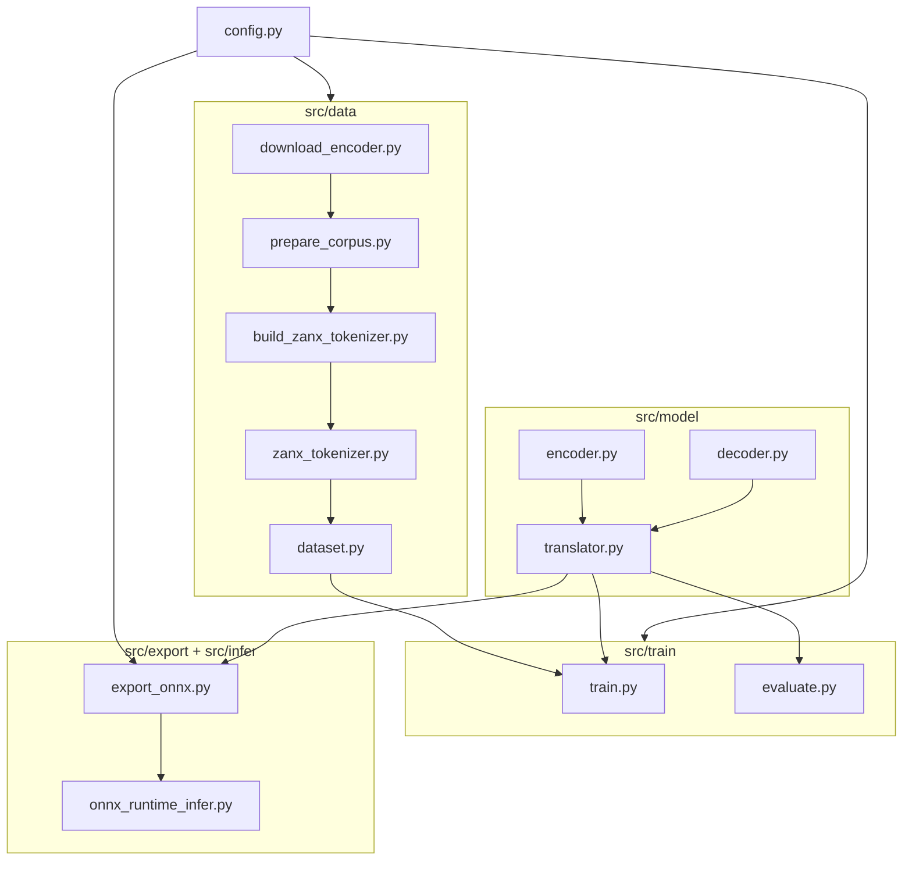

# Source Code Documentation (`src/`)

Detailed reference for every file under `src/`: what it does, why it exists, and how it connects to the rest of the English → zanX translator.

---

## Table of contents

1. [Overview](#1-overview)
2. [How the modules connect](#2-how-the-modules-connect)
3. [Root package](#3-root-package)
4. [Configuration (`src/config.py`)](#4-configuration-srcconfigpy)
5. [Data layer (`src/data/`)](#5-data-layer-srcdata)
6. [Model layer (`src/model/`)](#6-model-layer-srcmodel)
7. [Training layer (`src/train/`)](#7-training-layer-srctrain)
8. [Export layer (`src/export/`)](#8-export-layer-srcexport)
9. [Inference layer (`src/infer/`)](#9-inference-layer-srcinfer)
10. [Typical execution order](#10-typical-execution-order)
11. [Artifacts produced by each step](#11-artifacts-produced-by-each-step)

---

## 1. Overview

The `src/` package implements a **lightweight encoder–decoder translator**:

| Side | Component | Pretrained? |
|------|-----------|-------------|
| Source (English) | BERT-Mini encoder (`prajjwal1/bert-mini`) | Yes — frozen by default |
| Target (zanX) | Custom Transformer decoder + word tokenizer | No — trained on your corpus |

```
src/
├── __init__.py                 # Package marker
├── config.py                   # Load YAML config + resolve paths
├── data/                       # Corpus prep, tokenizers, PyTorch dataset
│   ├── download_encoder.py
│   ├── prepare_corpus.py
│   ├── build_zanx_tokenizer.py
│   ├── zanx_tokenizer.py
│   └── dataset.py
├── model/                      # Neural network architecture
│   ├── encoder.py
│   ├── decoder.py
│   └── translator.py
├── train/                      # Training and evaluation loops
│   ├── train.py
│   └── evaluate.py
├── export/                     # PyTorch → ONNX v2 bundle
│   └── export_onnx.py
└── infer/                      # CPU inference via ONNX Runtime
    └── onnx_runtime_infer.py
```

---

## 2. How the modules connect



**Data flow during training:**

```
TSV pairs → prepare_corpus → JSONL splits
                         → build_zanx_tokenizer → zanx_vocab.json
JSONL + tokenizers → TranslationDataset → DataLoader → EnToZanxTranslator → loss
```

**Data flow during inference:**

```
English text → BertTokenizer → encoder ONNX → memory vectors
            → decoder ONNX (loop) → zanX token IDs → ZanxTokenizer.decode → zanX string
```

---

## 3. Root package

### `src/__init__.py`

| | |
|---|---|
| **Purpose** | Marks `src` as a Python package so modules can be run with `python -m src.train.train`. |
| **Contents** | Single docstring: `"""English to zanX research translator."""` |
| **When it runs** | Imported automatically when any `src.*` module is loaded. |

---

## 4. Configuration (`src/config.py`)

Central helper for reading project settings and resolving file paths relative to the repo root.

### Constants

| Name | Value | Purpose |
|------|-------|---------|
| `ROOT` | Parent of `src/` (project root) | Anchor for all relative paths |

### Functions

#### `load_config(path=None) -> dict`

| | |
|---|---|
| **Purpose** | Load a YAML config file into a Python dictionary. |
| **Default** | `configs/default.yaml` when `path` is omitted. |
| **Used by** | `train.py`, `evaluate.py`, `export_onnx.py` |
| **Returns** | Nested dict with keys: `model`, `data`, `training`, `export` |

#### `resolve_path(value) -> Path`

| | |
|---|---|
| **Purpose** | Convert a relative path (e.g. `data/processed/train.jsonl`) to an absolute path under `ROOT`. |
| **Behavior** | If `value` is already absolute, returns it unchanged. |
| **Used by** | Nearly every script that reads or writes files. |

**Example:**

```python
from src.config import load_config, resolve_path

config = load_config("configs/dev.yaml")
train_path = resolve_path(config["data"]["train_path"])
# → C:\...\lang-translator\data\processed\train.jsonl
```

---

## 5. Data layer (`src/data/`)

Handles everything **before** model training: downloading the English encoder, preparing parallel text, building the zanX vocabulary, and feeding batches to PyTorch.

---

### `src/data/download_encoder.py`

| | |
|---|---|
| **Purpose** | One-time download of the English encoder (BERT-Mini) for **offline development**. |
| **CLI** | `python -m src.data.download_encoder` |
| **Default model** | `prajjwal1/bert-mini` |
| **Default output** | `artifacts/models/bert-mini/` |

#### `main()`

1. Parses `--model` and `--out` arguments.
2. Calls Hugging Face `snapshot_download()` to copy all model files locally.
3. Prints confirmation path.

**Why it exists:** Avoids `huggingface-cli` Unicode issues on some Windows terminals; gives a reproducible, scriptable download step.

**Output files:** `config.json`, `pytorch_model.bin` (or `model.safetensors`), `tokenizer.json`, `vocab.txt`, etc.

---

### `src/data/prepare_corpus.py`

| | |
|---|---|
| **Purpose** | Convert raw parallel TSV data into train/validation/test JSONL files. |
| **CLI** | `python -m src.data.prepare_corpus --input data/raw/sample_en_zanx_pairs.tsv` |
| **Default output** | `data/processed/train.jsonl`, `val.jsonl`, `test.jsonl` |

#### `read_pairs(path) -> list[dict]`

| | |
|---|---|
| **Input** | TSV file with header row containing columns `en` and `zanx` |
| **Output** | List of `{"en": "...", "zanx": "..."}` dicts |
| **Validation** | Skips blank lines; requires both fields non-empty |

**Expected TSV format:**

```tsv
en	zanx
Hello world	ka moro tera
```

#### `write_jsonl(path, rows)`

Writes one JSON object per line (JSONL format), UTF-8 encoded.

#### `split_pairs(pairs, train_ratio=0.8, val_ratio=0.1, seed=42)`

| | |
|---|---|
| **Purpose** | Random shuffle + split into train (80%), val (10%), test (remainder). |
| **Reproducibility** | Fixed `seed` ensures same splits across runs. |

#### `main()`

Orchestrates: read → split → write three JSONL files. Exits with error if no pairs found.

---

### `src/data/zanx_tokenizer.py`

| | |
|---|---|
| **Purpose** | **Word-level** tokenizer for the zanX target language. Every zanX word maps to one token ID. |
| **Design choice** | Suited for constructed research languages with a finite, known vocabulary. |

#### Special tokens

| Token | ID (after `build_vocab`) | Role |
|-------|--------------------------|------|
| `<pad>` | 0 | Padding to fixed sequence length |
| `<unk>` | 1 | Unknown zanX word at inference time |
| `<bos>` | 2 | Beginning of zanX sequence |
| `<eos>` | 3 | End of zanX sequence |

#### Class: `ZanxTokenizer`

| Method | Purpose |
|--------|---------|
| `normalize(text)` | Lowercase, strip, collapse whitespace |
| `tokenize(text)` | Split on spaces → list of words |
| `build_vocab(sentences, min_freq=1)` | Count word frequencies; assign IDs starting after special tokens |
| `encode(text, add_special=True, max_len=None)` | Text → list of integer IDs; optionally pad/truncate |
| `decode(ids, skip_special=True)` | IDs → zanX string |
| `save(directory)` | Write `zanx_vocab.json` |
| `load(directory)` | Class method — rebuild tokenizer from saved vocab |

**Properties:** `pad_id`, `unk_id`, `bos_id`, `eos_id`, `vocab_size`

**Training usage:** Sequences look like `[<bos>, word1, word2, ..., <eos>, <pad>, ...]`

---

### `src/data/build_zanx_tokenizer.py`

| | |
|---|---|
| **Purpose** | CLI wrapper to build and save the zanX vocabulary from training data. |
| **CLI** | `python -m src.data.build_zanx_tokenizer --input data/processed/train.jsonl` |
| **Default output** | `artifacts/tokenizer/zanx/zanx_vocab.json` |

#### `load_zanx_sentences(*paths) -> list[str]`

Reads zanX sentences from:
- **JSONL** files (field `"zanx"`)
- **Plain text** files (one sentence per line)

#### `main()`

1. Load zanX sentences from `--input`.
2. Create `ZanxTokenizer`, call `build_vocab()`.
3. Save to `--out`.

**Must run after** `prepare_corpus` and **before** `train`.

---

### `src/data/dataset.py`

| | |
|---|---|
| **Purpose** | PyTorch `Dataset` that yields tokenized English + zanX pairs for training. |
| **Used by** | `train.py`, `evaluate.py` |

#### Class: `TranslationDataset(Dataset)`

**Constructor parameters:**

| Parameter | Purpose |
|-----------|---------|
| `jsonl_path` | Path to `train.jsonl`, `val.jsonl`, or `test.jsonl` |
| `en_tokenizer` | Hugging Face `BertTokenizer` (English WordPiece) |
| `zanx_tokenizer` | `ZanxTokenizer` instance |
| `max_en_len` | Max English sequence length (pad/truncate) |
| `max_zanx_len` | Max zanX sequence length (pad/truncate) |

#### `__getitem__(index) -> dict`

Returns a batch-ready dict with three tensors:

| Key | Shape | Description |
|-----|-------|-------------|
| `en_input_ids` | `[max_en_len]` | BERT token IDs for English |
| `en_attention_mask` | `[max_en_len]` | 1 = real token, 0 = padding |
| `zanx_input_ids` | `[max_zanx_len]` | zanX token IDs with BOS/EOS/PAD |

---

## 6. Model layer (`src/model/`)

The neural network: frozen English encoder + trainable zanX decoder, combined in one module.

---

### `src/model/encoder.py`

| | |
|---|---|
| **Purpose** | Wrap **BERT-Mini** as a frozen English sentence encoder. |
| **Input** | English `input_ids` + `attention_mask` |
| **Output** | Contextual vectors `[batch, seq_len, hidden_size]` (256 for bert-mini) |

#### Class: `EnglishEncoder(nn.Module)`

| | |
|---|---|
| **`__init__(model_path, freeze=True)`** | Loads `BertModel.from_pretrained()`. If local path exists, uses `local_files_only=True` (offline). If `freeze=True`, disables gradients on all encoder weights. |
| **`hidden_size`** | Read from BERT config (256 for bert-mini). |
| **`forward(input_ids, attention_mask)`** | Returns `last_hidden_state` — one vector per English subword token. |

**Why frozen:** English understanding comes from pretraining; only the zanX decoder should learn from your research corpus.

---

### `src/model/decoder.py`

| | |
|---|---|
| **Purpose** | Autoregressive **Transformer decoder** that generates zanX tokens conditioned on English encoder output. |
| **Architecture** | Embedding + positional encoding + `nn.TransformerDecoder` + linear output layer |

#### Class: `ZanxDecoder(nn.Module)`

**Constructor parameters:**

| Parameter | Default | Purpose |
|-----------|---------|---------|
| `vocab_size` | — | Size of zanX vocabulary |
| `d_model` | 256 | Hidden dimension (matches encoder) |
| `nhead` | 4 | Attention heads |
| `num_layers` | 2 | Decoder transformer layers |
| `dim_feedforward` | 512 | FFN inner dimension |
| `dropout` | 0.1 | Regularization |
| `max_len` | 128 | Max positions for positional embedding |

#### Key methods

| Method | Purpose |
|--------|---------|
| `_positional(tgt_ids)` | Token embedding × √d_model + position embedding |
| `_causal_mask(size, device)` | Upper-triangular mask — prevents attending to future tokens |
| `forward(tgt_ids, memory, ...)` | Cross-attention: `tgt` attends to English `memory`; returns logits `[batch, tgt_len, vocab_size]` |

**Masks:**
- `tgt_key_padding_mask` — ignore `<pad>` positions in zanX input
- `memory_key_padding_mask` — ignore English padding positions

---

### `src/model/translator.py`

| | |
|---|---|
| **Purpose** | **Full translation model** — wires encoder + decoder + training loss + greedy inference. |
| **This is the main model class** used everywhere else. |

#### Class: `EnToZanxTranslator(nn.Module)`

**Constructor:**

```
EnToZanxTranslator(
    encoder_path,       # path to bert-mini
    vocab_size,         # from ZanxTokenizer
    freeze_encoder=True,
    decoder_layers=2,
    decoder_dim=256,
    decoder_heads=4,
    max_len=128,
)
```

| Sub-module | Purpose |
|------------|---------|
| `self.encoder` | `EnglishEncoder` |
| `self.encoder_proj` | `Linear` or `Identity` — aligns encoder hidden size to decoder dim |
| `self.decoder` | `ZanxDecoder` |
| `self.pad_id` | 0 — used to ignore padding in loss |

#### Methods

##### `encode(input_ids, attention_mask) -> (memory, memory_padding)`

Runs English through BERT, projects to decoder dimension, returns encoder output + padding mask.

##### `forward(en_input_ids, en_attention_mask, zanx_input_ids) -> logits`

Full training forward pass: encode English → decode zanX → vocabulary logits.

##### `compute_loss(en_input_ids, en_attention_mask, zanx_input_ids) -> scalar`

**Teacher forcing** training:

```
decoder_input = zanx[:, :-1]   # <bos> w1 w2 ... wN-1
targets       = zanx[:, 1:]    # w1 w2 ... wN <eos>
loss = CrossEntropy(logits, targets, ignore_index=pad)
```

##### `translate(en_input_ids, en_attention_mask, bos_id, eos_id, max_len) -> list[int]`

**Greedy inference** (no grad):

1. Encode English once.
2. Start with `[<bos>]`.
3. Loop: run decoder → take argmax of last position → append token.
4. Stop at `<eos>` or `max_len`.

---

## 7. Training layer (`src/train/`)

---

### `src/train/train.py`

| | |
|---|---|
| **Purpose** | Full training loop with validation, checkpointing, and early stopping. |
| **CLI** | `python -m src.train.train --config configs/dev.yaml` |
| **Default output** | `artifacts/checkpoints/best.pt` |

#### Helper functions

| Function | Purpose |
|----------|---------|
| `set_seed(seed)` | Reproducible randomness (Python + PyTorch) |
| `resolve_encoder_path(model_cfg)` | Prefer local `encoder_local_path`; fallback to Hugging Face model name |
| `build_dataloader(...)` | Wraps `TranslationDataset` in a PyTorch `DataLoader` |
| `run_epoch(model, dataloader, optimizer, device, train, grad_accum)` | One pass over data; returns average loss. Supports gradient accumulation. |
| `save_checkpoint(path, model, optimizer, epoch, val_loss, config)` | Saves `.pt` file with weights + metadata |

#### `main()` training loop

```
For each epoch:
    1. train_loss = run_epoch(train_loader, train=True)
    2. val_loss   = run_epoch(val_loader, train=False)
    3. If val_loss improved → save best.pt
    4. If no improvement for `early_stopping_patience` epochs → stop
Write train_metrics.json with best_val_loss
```

**Optimizer:** AdamW on **trainable parameters only** (decoder + projection; encoder frozen).

**Device:** CPU (`torch.device("cpu")`) — designed for 8 GB RAM Windows machines.

#### Checkpoint format (`best.pt`)

```python
{
    "model_state_dict": ...,      # all translator weights
    "optimizer_state_dict": ...,  # AdamW state
    "epoch": int,
    "val_loss": float,
    "config": dict,              # full YAML config used
}
```

---

### `src/train/evaluate.py`

| | |
|---|---|
| **Purpose** | Measure loss on val/test set and print side-by-side translation examples. |
| **CLI** | `python -m src.train.evaluate --config configs/dev.yaml --split test` |

#### `print_samples(model, dataloader, ..., limit=5)`

For up to `limit` examples, prints:

```
EN:      <english source>
TARGET:  <ground truth zanX>
PRED:    <model prediction>
---
```

#### `main()`

1. Load config, tokenizers, model.
2. Load checkpoint weights.
3. Compute split loss via `run_epoch(train=False)`.
4. Print sample translations.

**Use this** to visually inspect model quality before ONNX export.

---

## 8. Export layer (`src/export/`)

---

### `src/export/export_onnx.py`

| | |
|---|---|
| **Purpose** | Export trained PyTorch model to **ONNX v2 research bundle** for portable CPU inference. |
| **CLI** | `python -m src.export.export_onnx --config configs/dev.yaml` |
| **Default output** | `artifacts/releases/v2/` |

#### Export strategy: hybrid (two graphs)

| ONNX file | Wraps | Inputs | Outputs |
|-----------|-------|--------|---------|
| `encoder-v2.onnx` | `EncoderOnnxWrapper` | `input_ids`, `attention_mask` | `memory` |
| `decoder-step-v2.onnx` | `DecoderStepOnnxWrapper` | `tgt_ids`, `memory`, `memory_key_padding_mask` | `logits` |

**Why two files:** Autoregressive decoding (token-by-token loop) is run in Python/ONNX Runtime caller; each decoder step is one ONNX forward pass. Easier to debug and validate for research.

#### Wrapper classes

| Class | Purpose |
|-------|---------|
| `EncoderOnnxWrapper` | Thin module exposing `model.encode()` for ONNX tracing |
| `DecoderStepOnnxWrapper` | Exposes only `model.decoder` forward pass |

#### `export_module(...)`

Generic `torch.onnx.export()` helper with dynamic batch/sequence axes (opset 17 by default).

#### `main()` bundle contents

After export, writes:

```
artifacts/releases/v2/
├── encoder-v2.onnx
├── decoder-step-v2.onnx
├── zanx_vocab.json          # copied from artifacts/tokenizer/zanx/
├── en_tokenizer/            # copied from artifacts/models/bert-mini/
└── manifest.json            # version, opset, file names, metadata
```

---

## 9. Inference layer (`src/infer/`)

---

### `src/infer/onnx_runtime_infer.py`

| | |
|---|---|
| **Purpose** | Run translation using exported ONNX models — **no PyTorch required at inference time**. |
| **CLI** | `python -m src.infer.onnx_runtime_infer --text "Hello world"` |
| **Default bundle** | `artifacts/releases/v2/` |

#### Class: `OnnxTranslator`

**Constructor (`bundle_dir`):**

1. Read `manifest.json` for ONNX file names.
2. Load `ZanxTokenizer` from `zanx_vocab.json`.
3. Load `BertTokenizer` from `en_tokenizer/`.
4. Create ONNX Runtime sessions with `CPUExecutionProvider`.

#### `translate(text, max_len=128) -> str`

```
1. Tokenize English with BertTokenizer
2. encoder.run() → memory tensor
3. generated = [<bos>]
4. Loop:
       decoder.run(tgt_ids=generated, memory, mask) → logits
       next_token = argmax(logits[-1])
       append to generated
       stop if <eos>
5. ZanxTokenizer.decode(generated) → zanX string
```

**Why ONNX Runtime:** Lightweight CPU inference (~200–350 MB RAM), portable for research distribution without sharing PyTorch checkpoints.

---

## 10. Typical execution order

Run these commands **in order** from the project root:

| Step | Command | Module |
|------|---------|--------|
| 0 | `pip install ...` | (environment) |
| 1 | `python -m src.data.download_encoder` | `download_encoder.py` |
| 2 | `python -m src.data.prepare_corpus --input data/raw/your_pairs.tsv` | `prepare_corpus.py` |
| 3 | `python -m src.data.build_zanx_tokenizer` | `build_zanx_tokenizer.py` |
| 4 | `python -m src.train.train --config configs/dev.yaml` | `train.py` |
| 5 | `python -m src.train.evaluate --config configs/dev.yaml` | `evaluate.py` |
| 6 | `python -m src.export.export_onnx --config configs/dev.yaml` | `export_onnx.py` |
| 7 | `python -m src.infer.onnx_runtime_infer --text "Hello"` | `onnx_runtime_infer.py` |

---

## 11. Artifacts produced by each step

| Step | Script | Creates |
|------|--------|---------|
| Download | `download_encoder.py` | `artifacts/models/bert-mini/` |
| Corpus | `prepare_corpus.py` | `data/processed/train.jsonl`, `val.jsonl`, `test.jsonl` |
| Tokenizer | `build_zanx_tokenizer.py` | `artifacts/tokenizer/zanx/zanx_vocab.json` |
| Train | `train.py` | `artifacts/checkpoints/best.pt`, `train_metrics.json` |
| Export | `export_onnx.py` | `artifacts/releases/v2/` (ONNX bundle) |
| Infer | `onnx_runtime_infer.py` | (no files — prints translation) |

---

## Quick reference: which file do I edit?

| Goal | File to edit |
|------|--------------|
| Change model size / encoder | `configs/default.yaml` |
| Add new training hyperparameters | `configs/default.yaml` + `train.py` |
| Change zanX tokenization rules | `zanx_tokenizer.py` |
| Change decoder architecture | `decoder.py` |
| Swap English encoder | `encoder.py` + config `encoder_name` |
| Change loss or inference logic | `translator.py` |
| Add new data format support | `prepare_corpus.py` |
| Change ONNX export format | `export_onnx.py` |
| Change inference behavior | `onnx_runtime_infer.py` |

---

## Related docs

- [ARCHITECTURE.md](ARCHITECTURE.md) — system design and diagrams
- [PREREQUISITES.md](PREREQUISITES.md) — setup, hardware, libraries
- [TRAINING_GUIDE.md](TRAINING_GUIDE.md) — step-by-step workflow
